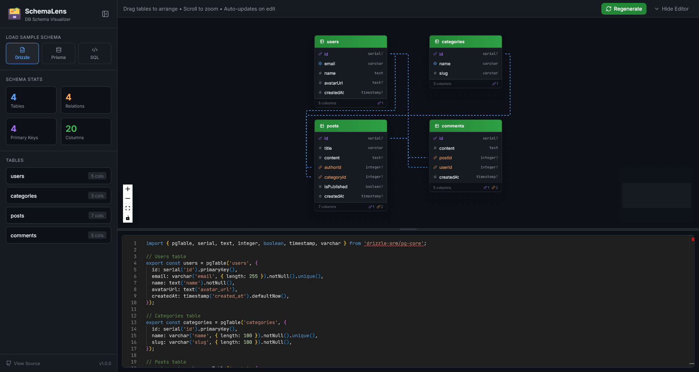

# 🗃️ SchemaLens

**SchemaLens** is a powerful, interactive database schema visualizer tailored for modern developers. It instantly transforms your **Drizzle ORM**, **Prisma**, or generic **SQL** schemas into beautiful, interactive entity-relationship diagrams.

 <!-- You can replace this with a real screenshot later -->

## ✨ Features

- **Multi-Format Support**:
  - 🌧️ **Drizzle ORM**: Paste your Drizzle schema definitions directly.
  - 💎 **Prisma**: Visualize your `schema.prisma` files.
  - 🐘 **SQL**: Support for standard SQL `CREATE TABLE` statements.
- **Interactive Diagrams**:
  - Drag and arrange tables to organize your view.
  - Zoom and pan to explore large schemas.
  - Auto-layout capabilities.
- **Real-time Parsing**: See changes in the diagram instantly as you edit the code.
- **Code Editor**: Integrated Monaco Editor for a premium coding experience.
- **Flexible Workspace Layout**: Move the editor between bottom, left, and right positions, and place the sidebar on either side.
- **Agent Chat**: Use your own provider API key with OpenAI-compatible providers, Claude/Anthropic, DeepSeek, Kimi, Gemini, OpenRouter, Groq, Mistral, xAI, or custom endpoints to generate or refine schemas through chat and apply them directly to the editor.
- **Code Agent Handoff**: Export the current schema, parsed metadata, diagram context, and implementation instructions as a curl-readable handoff bundle for coding agents.
- **Privacy Focused**: All parsing happens client-side. Your schema code never leaves your browser.

## 🛠️ Tech Stack

Built with the latest modern web technologies:

- **Framework**: [React 19](https://react.dev/)
- **Build Tool**: [Vite](https://vitejs.dev/)
- **Styling**: [Tailwind CSS](https://tailwindcss.com/)
- **State Management**: [Zustand](https://github.com/pmndrs/zustand)
- **Visualization**: [React Flow (@xyflow/react)](https://reactflow.dev/)
- **Editor**: [Monaco Editor](https://microsoft.github.io/monaco-editor/)
- **Icons**: [Lucide React](https://lucide.dev/)

## 🚀 Getting Started

Follow these steps to run SchemaLens locally on your machine.

### Prerequisites

- [Node.js](https://nodejs.org/) (v18 or higher)
- [Bun](https://bun.sh/) (Optional, but recommended as `bun.lock` is included)

### Installation

1. **Clone the repository**

   ```bash
   git clone https://github.com/tutkuofnight/schema-lens.git
   cd schema-lens
   ```

2. **Install dependencies**
   Using Bun (recommended):

   ```bash
   bun install
   ```

   Or using npm:

   ```bash
   npm install
   ```

3. **Start the development server**

   ```bash
   bun run dev
   # or
   npm run dev
   ```

4. **Open your browser**
   Navigate to `http://localhost:5173` to start using SchemaLens.

## 📖 Usage

1. Open the application.
2. Select your schema format (Drizzle, Prisma, or SQL) from the sidebar.
3. Paste your schema code into the editor and move it to the bottom, left, or right as needed.
4. Watch the diagram generate automatically!
5. Drag tables to rearrange them.
6. Open Agent Chat, choose a provider, enter your API key, and ask the agent to create or update a schema. Keys are stored only in the current tab's `sessionStorage` until the tab closes; returned schema code blocks are applied to the editor automatically.
7. Use **Hand off to Code Agent** to copy a `curl` command that writes a `schema-lens-handoff.json` bundle for coding agents to read and apply in another project.

## 🤝 Contributing

Contributions are welcome! Please feel free to submit a Pull Request.

1. Fork the project
2. Create your feature branch (`git checkout -b feature/AmazingFeature`)
3. Commit your changes (`git commit -m 'Add some AmazingFeature'`)
4. Push to the branch (`git push origin feature/AmazingFeature`)
5. Open a Pull Request
